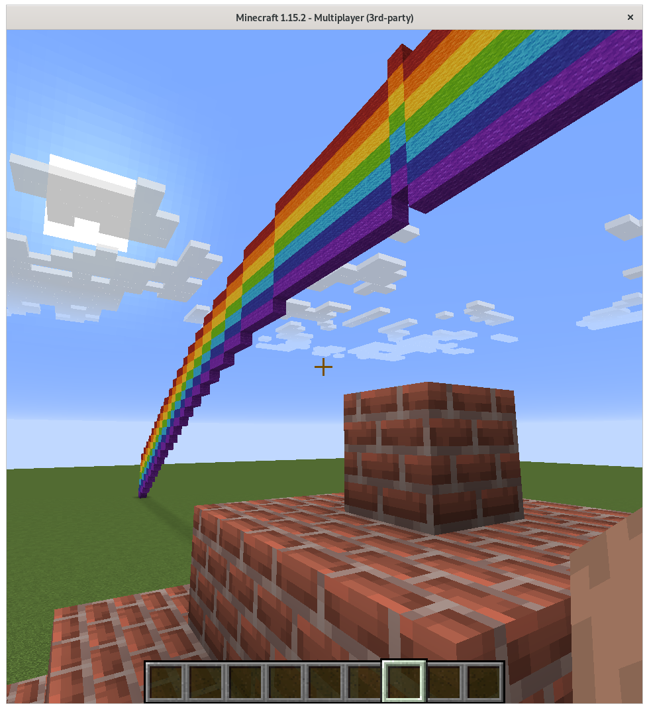

# McThings Extra

Extra Things to be used building [McThings](https://github.com/juntosdesdecasa/mcthings) scenes.

Below [a scene](tests/scene.py) including the extra Thing [Rainbow](mcthings_extra/rainbow.py) with the 
McThings [Pyramid](https://github.com/juntosdesdecasa/mcthings/blob/develop/mcthings/pyramid.py).

